# Dungeon Master's Tools
[](README.us.md)
---
[](ToDo-ptbr.md)

## Conceito
Esse projeto foi desenvolvido com intuíto de prover uma aplicação desktop, para uso em *D&D 4e e outros RPGs* por *Dungeon Masters*, que fosse de fácil manutenibilidade e expansível. Para tal, o programa dispõe de uma funcionalidade básica para ler arquivos *sql* do antigo serviço *D&D Insiders* e mostrar esses dados em tabelas permitindo filtragem, busca e ordenação. Além, de dispor da capacidade de carregar *plugins* feitos por usuários.

## Pré-requisitos e recursos
O projeto utiliza Python 3.10.12, além de duas bibliotecas externas:
- PySide6, disponível em ([PyPi](https://pypi.org/project/PySide6/))
- yapsy, disponível em ([PyPi](https://pypi.org/project/Yapsy/))

## Passo a Passo
O projeto se deu da vontade de implementar uma alternativa ao software, baseado em java/javaFx, *Portable D&D Compendium* (infeliz indisponível para compartilhamento aqui). O processo de implementação se deu através de:
1. Baixar o software *Portable D&D Compendium*;
2. Extrair o conteúdo do seu pacote javac;
3. Utilizar de ferramentas (vscode e JD-GUI) para descompilar o conteúdo dos arquivos *class*;
4. Reproduzir parcialmente o funcionamento do seu *Parser* para os arquivos *SQL* do antigo *D&D Insider* (o resultado disso foi a classe [*DDIParser*](libs/DMTCore.py#L54));
5. A partir daqui o desenvolvimento focou-se em apresentar esses dados em um formato humano (uma tabela, parcialmente igual ao *Portable D&D Compendium*, o resultado é a classe [*CompendiumScreen*](libs/DMTCore.py#L1226));
6. Utilizando a documentação do [Pyside/QT](https://doc.qt.io/qtforpython-6/PySide6/QtWidgets/) e experimentação a recriação da tabela do software original foi alcançada com sucesso;
7. Fora a recriação do software original em Python/Pyside, buscou-se introduzir novas funcionalidades como a capacidade de carregar plugins e a criação de uma filtragem dinâmica baseada na categoria dos itens dispostos na tabela; [Exemplo](#filtro-dinâmicoprimary-filters)
8. Como efeito colateral do uso de Python a aplicação agora é nativamente compatível com linux e Windows e, possivelmente, qualquer sistema operacional que dê suporte ao Python e a biblioteca Pyside6;

## Instalação
- Clone o projeto pelo git, ou faça o download pelo Github:
```
git clone https://github.com/CMS999/Dungeon-Master-s-Tools.git
```

## Execução
- Na pasta raiz do projeto (Dungeon-Master-s-Tools) execute o arquivo main.py
```
python main.py
```
## Bugs
Alguns bugs já são conhecidos, mas devido a natureza do projeto espera-se encontrar mais:
- O número no rodapé da página indicando a quantidade de itens sendo visualizados em um dado momento, ainda não está sendo atualizado sempre;
- A funcionalidade das *QToolBar* de cada aba, não funciona apropriadamente, abas sem um *QToolBar* associado geram uma *QToolbar* "fantasma";
- Mudar para aba Filtros enquanto uma entrada da tabela está selecionada faz com que cada filtragem altere o display para o *HTMLRender*;
- Alguns textos e ícones ainda são temporários/*placeholders* (Ex.: o ícone da aplicação no canto superior esquerdo é o padrão do sistema);
- O programa não foi testado em nenhum momento em Windows e, embora, ele execute, é possível que diferenças de sistemas operacionais apareçam (Ex.: foi necessário adicionar um estilo 'Fusion' no app em *main.py*, pois o estilo padrão do Windows não estava sendo aplicado, como é no linux).

## Autor
- Cauã Marques da Silva ([GitHub](https://github.com/CMS999))

## Plugins
Ainda que rudimentares, a aplicação é capaz de carregar e exibir outras telas criadas com o Pyside6, desde que respeitem a interface especificada em  [PluginTypes](libs/PluginTypes.py). [Exemplo](#exemplo-de-plugin)

Um plugin é composto de no mínimo dois arquivos:
- Arquivo python com uma classe que herde da classe *MainPlugin*, a classe herdeira é a que será exibida na tela;
- Um arquivo de especificação do tipo **.yapsy-plugin** com o seguinte conteudo:
```
[Core]
Name = Nome_do_seu_plugin
Module = Nome_do_arquivo_python_com_o_plugin
```
## Imagens
### Exemplo de Plugin
#### Tela do Plugin
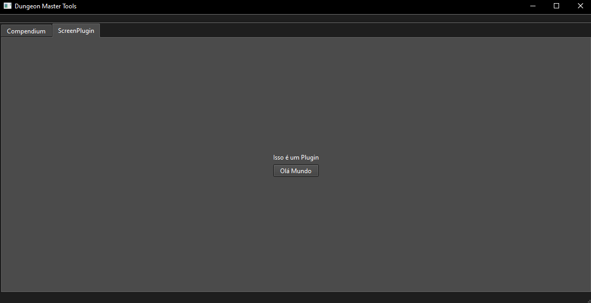
#### Após clicar no botão
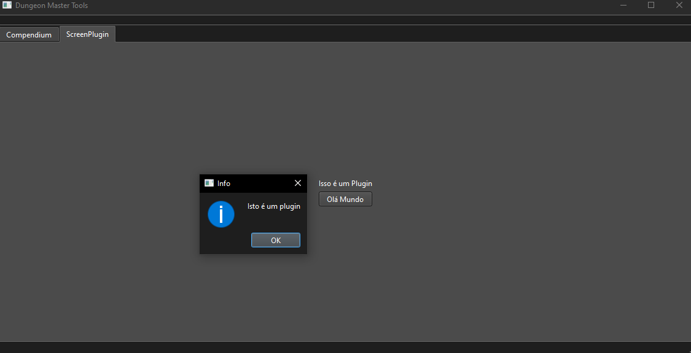

### Filtro Dinâmico/Primary Filters
#### Filtro na categoria ALL
##### Portable D&D Compendium
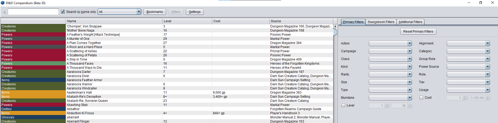
##### Dungeon Master's Tools
Aqui a categoria ALL só possui colunas que já tem seus respectivos filtros, por isso a aba está vazia.

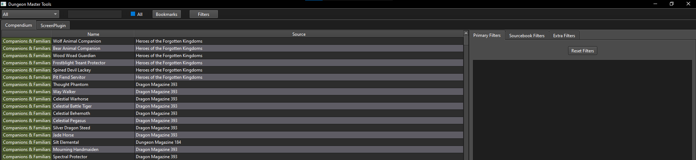
#### Filtro na categoria Creature
##### Portable D&D Compendium
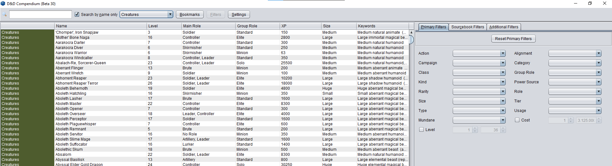
##### Dungeon Master's Tools
Aqui somente as colunas pertinentes são exibidas.

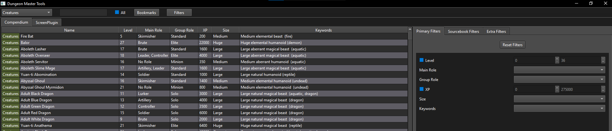
### Monster Manual 3 (MM3) Filter
Esse filtro remove da tabela todos os monstros que foram escritos antes do terceiro manual de monstros, no qual houve uma mudança no design das fichas de monstro.
#### Portable D&D Compendium
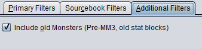
#### Dungeon Master's Tools
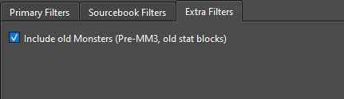

#### Pré-MM3
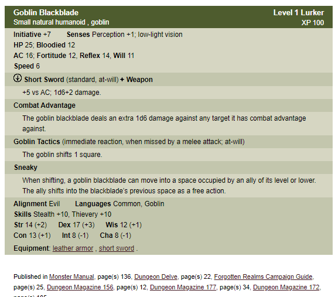

#### Pós-MM3
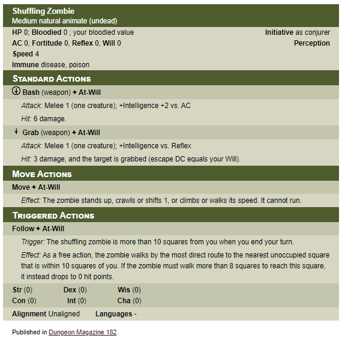

### Source Filter
Esse filtro restringe a exibição das entradas que fazem parte das fontes exibidas.

#### Portable D&D Compendium
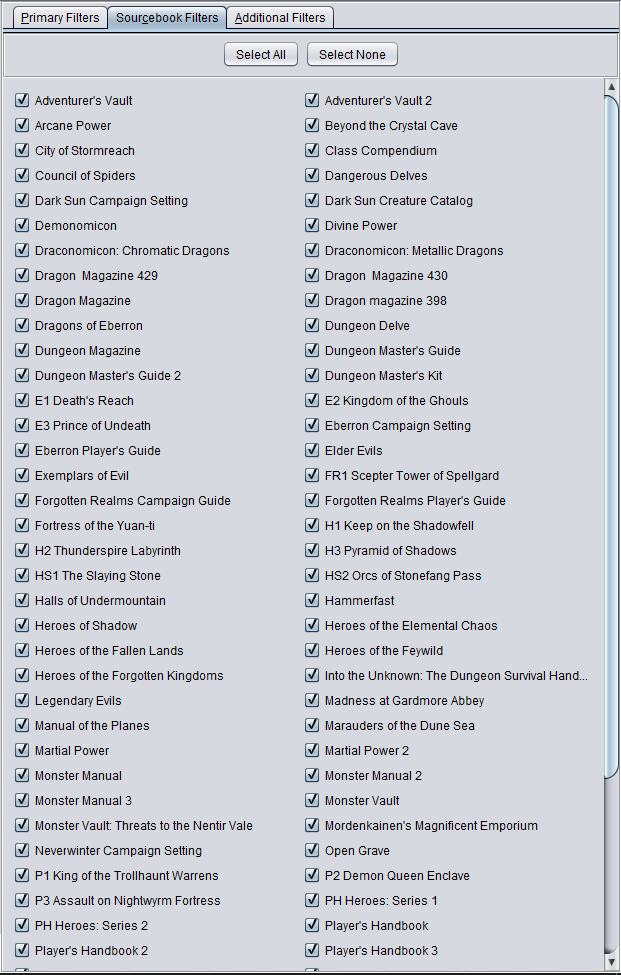
#### Dungeon Master's Tools
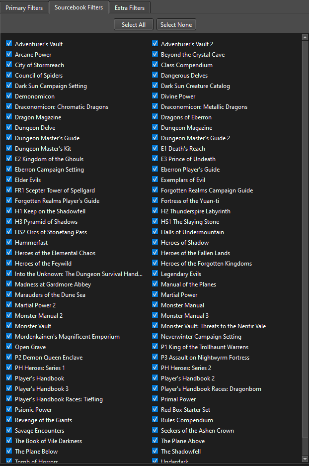

### Context Menu
#### Portable D&D Compendium
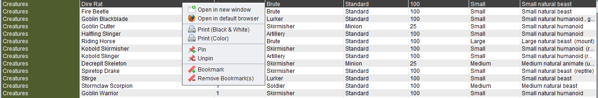
#### Dungeon Master's Tools
Ainda sem ícones.

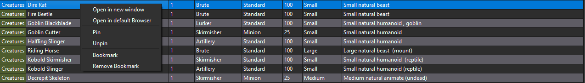

### Pinned itens
#### Portable D&D Compendium

#### Dungeon Master's Tools
O ícone é de coração é um placeholder.


### Bookmarks
#### Portable D&D Compendium
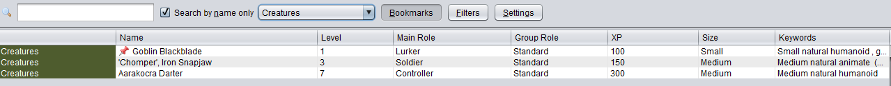
#### Dungeon Master's Tools
Items *Pinned* não aparecem no bookmarks (isso é intencional)

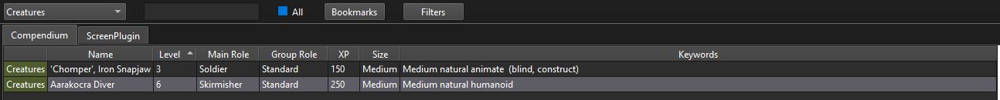